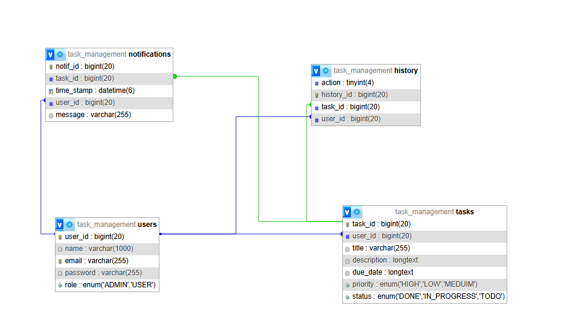

# Task Management System | Backend API

- This is a backend API designed for task management. It supports task management, user authentication and authorization, Search and filtering, and Email Notifications.

## Prerequisites
- Java 17 or higher
- Maven
- MySQL

## Features
- User authentication with JWT
- Task management (CRUD operations)
- APIs support pagination
- Stripe payment integration
- Validation and Error Handling
- API documentation using Postman
  
## Technologies Used
- Java 17
- Spring Boot
- MySQL
- REST API

## ER Diagram
The Entity-Relationship (ER) Diagram for the database is shown below:

## Future Enhancements
- Improve test coverage

## Contributors
- [Ahmed Mohamed](https://github.com/ahmed-sayad)

